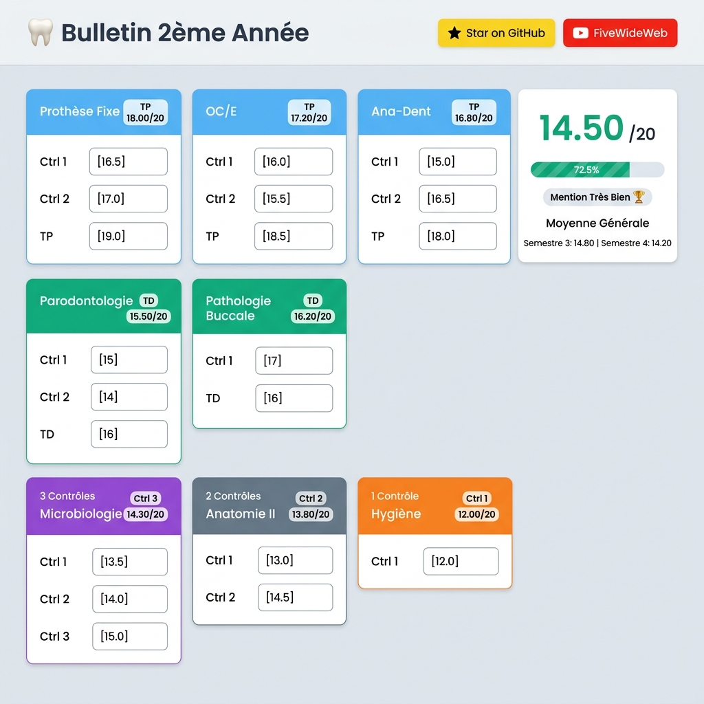

<div align="center">
<h1>🦷 Dentaire Moyenne</h1>

<p><strong>Calculateur de notes pondérées — 2ème Année Médecine Dentaire (Algérie)</strong></p>

[](https://react.dev)
[](https://www.typescriptlang.org)
[](https://tailwindcss.com)
[](https://vite.dev)
[](LICENSE)

[](https://youtube.com/@fivewideweb)
[](https://github.com/BenhamadaKhalil/Dentaire-Moyenne)

</div>

---

## 📸 Aperçu



---

## ✨ Fonctionnalités

- 🧮 **5 formules de calcul** selon le type de module (TP, TD, 3 ctrl, 2 ctrl, 1 ctrl)
- 🎨 **Code couleur** par type de module pour une lecture rapide
- 📊 **Panneau récapitulatif** en temps réel avec moyenne générale pondérée
- ✅ **Validation des notes** (0–20, alerte visuelle si invalide)
- 📈 **Barre de progression** des modules renseignés
- 🏆 **Mention automatique** (Admis / Bien / Très Bien / Insuffisant)
- 🔄 **Réinitialisation** en un clic
- 📱 **Responsive** — fonctionne sur mobile, tablette et desktop

---

## 🧮 Formules de calcul

| Type | Formule | Modules concernés |
|------|---------|-------------------|
| **TP** | `(TP × 2 + (C1+C2)/2) / 3` | Prothèse, OC/E, Ana-Dent |
| **TD** | `(TD + (C1+C2)/2) / 2` | Paro, Patho |
| **3 Ctrl** | `(C1 + C2 + C3) / 3` | Biomatériaux |
| **2 Ctrl** | `(C1 + C2) / 2` | ODF, Anato-Hum, Micro-Bio, Info |
| **1 Ctrl** | `C1` | Histo, Physio, Immuno, Hygiène, Anglais |

La **moyenne générale** est ensuite calculée en pondérant chaque module par son coefficient :

```
Moyenne = Σ(note_module × coef_module) / Σ(coef_modules_renseignés)
```

---

## 🗂️ Modules — 2ème Année

<details>
<summary>Voir tous les modules et coefficients</summary>

| Module | Coef | Type |
|--------|------|------|
| Prothèse | 5 | TP |
| OC/E | 5 | TP |
| Ana-Dent | 1 | TP |
| Paro | 3 | 1 Ctrl |
| Patho | 3 | 1 Ctrl |
| Biomatériaux | 2 | 3 Ctrl |
| ODF | 3 | 2 Ctrl |
| Anato-Hum | 4 | 2 Ctrl |
| Micro-Bio | 2 | 2 Ctrl |
| Info | 1 | TP |
| Histo | 3 | 1 Ctrl |
| Physio | 1 | 1 Ctrl |
| Immuno | 1 | 1 Ctrl |
| Hygiène | 1 | 1 Ctrl |
| Anglais | 1 | 1 Ctrl |

**Total coefficients : 37**

</details>

---

## 🚀 Démarrage rapide

### Prérequis

- [Node.js](https://nodejs.org) ≥ 18
- npm ≥ 9

### Installation

```bash
# Cloner le dépôt
git clone https://github.com/BenhamadaKhalil/Dentaire-Moyenne.git
cd Dentaire-Moyenne

# Installer les dépendances
npm install

# Lancer en développement
npm run dev
```

L'application sera disponible sur **http://localhost:5173**

### Scripts disponibles

| Commande | Description |
|----------|-------------|
| `npm run dev` | Serveur de développement avec HMR |
| `npm run build` | Build de production (`dist/`) |
| `npm run preview` | Prévisualisation du build de prod |
| `npm run lint` | Analyse statique du code avec ESLint |

---

## 🏗️ Stack technique

| Technologie | Version | Rôle |
|-------------|---------|------|
| [React](https://react.dev) | 19 | UI library |
| [TypeScript](https://www.typescriptlang.org) | 5 | Typage statique |
| [Tailwind CSS](https://tailwindcss.com) | v4 | Styling utility-first |
| [Vite](https://vite.dev) | 8 | Bundler & dev server |
| [@tailwindcss/vite](https://tailwindcss.com/docs/installation/using-vite) | latest | Plugin Tailwind pour Vite |
| [ESLint](https://eslint.org) | 10 | Linting |
| [typescript-eslint](https://typescript-eslint.io) | 8 | Règles TypeScript pour ESLint |

---

## 📁 Structure du projet

```
Dentaire-Moyenne/
├── public/
│   ├── favicon.svg
│   └── icons.svg
├── src/
│   ├── components/
│   │   ├── GradeInput.tsx      # Input de note avec validation
│   │   ├── ModuleCard.tsx      # Carte d'un module
│   │   ├── ScoreBadge.tsx      # Badge de note coloré
│   │   └── SummaryPanel.tsx    # Panneau récapitulatif latéral
│   ├── App.tsx                 # Composant racine + layout
│   ├── index.css               # Import Tailwind CSS
│   ├── main.tsx                # Point d'entrée React
│   ├── modules.ts              # Données des modules (id, nom, coef, type)
│   ├── types.ts                # Types TypeScript partagés
│   └── utils.ts                # Fonctions de calcul et helpers
├── docs/
│   └── images/                 # Assets pour le README
├── index.html
├── vite.config.ts
├── tsconfig.app.json
└── package.json
```

---

## 🤝 Contribuer

Les contributions sont les bienvenues ! Si tu veux ajouter des modules, corriger des formules ou améliorer l'UI :

1. **Fork** ce dépôt
2. **Crée ta branche** : `git checkout -b feat/ma-feature`
3. **Commit tes changements** : `git commit -m "feat: description"`
4. **Push** : `git push origin feat/ma-feature`
5. **Ouvre une Pull Request**

> [!NOTE]
> Utilise le style de commit [Conventional Commits](https://www.conventionalcommits.org) : `feat:`, `fix:`, `refactor:`, `style:`, etc.

---

## ⭐ Soutenir le projet

Si ce projet t'a aidé, **donne-lui une étoile sur GitHub** — ça prend 2 secondes et ça aide beaucoup !

[](https://github.com/BenhamadaKhalil/Dentaire-Moyenne)

Et si tu veux suivre d'autres projets et tutoriels, abonne-toi à la chaîne YouTube :

[](https://youtube.com/@fivewideweb)

---

## 📄 Licence

Ce projet est sous licence **MIT** — libre de l'utiliser, modifier et distribuer.

---

<div align="center">
  <p>Fait avec ❤️ pour les étudiants en médecine dentaire d'Algérie</p>
  <p>
    <a href="https://github.com/BenhamadaKhalil/Dentaire-Moyenne">GitHub</a> ·
    <a href="https://youtube.com/@fivewideweb">YouTube</a>
  </p>
</div>
